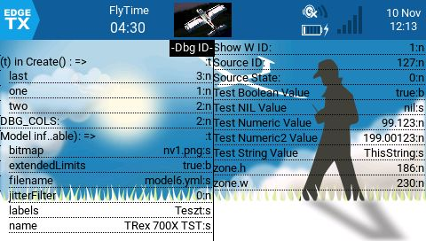

# Dbg

Debug your __EdgeTx__ LUA sript on tx screen in a widget in Companion.  
You can send formatted messages to the "log" window.  
__Works only on TX16S radio transmitter!__

All added information will appear in the widget ordered by name (msg).




See my DbgDemo widget !! -> https://github.com/Be-Gab/DbgDemo

## Warnings!
The variables added with the add() function do not follow the change in the value of the variables, they only display the value carried at the given point. The variable can be displayed several times with different labels (msg) by adding it to the dbg window at different points in the program.  
Do not use the Dbg widget in a production environment.  
Only use it in the Companion program during development!

## Import into your code
### Install
Download this widget, copy to your sdcard \WIDGET\Dbg directory and take this widget to the screen in Companion.
### The code

Use this codes beginning of your widget under developing.

```
dbg = nil

local function loadDbg(widget)

    if dbg ~= nil then
        return
    end 

    -- !!!!
  local chunk, errMsg = loadScript( "/WIDGETS/Dbg/dbg.lua" )

  if errMsg then
    widget.errMsg = errMsg
  else
    dbg = chunk()
  end

end
```

### Call in create()

Call that function in your widget Create() event.

```
    loadDbg(widget)
```

After this you can applying more setting, see below.

## Settings

You can set widget visibility from code.
```
    oldValue = dbg.set( key , newValue ) -- return the previous value

    -- Example:
    dbg.set( "DBG_COLS" , 2 )        -- default: 1
```

### Available Config keys

Keys, values and short explanation :

__DATE_FORMAT__ : "t", "hu" , "jp" , "ca" , "us", "uk"  
Date-Time format in log window.  
Formats:
- "t" = hh:mm:ss  -- Just the time, default
- "hu" = YYYY.MM.DD. hh:mm:ss
- "jp" = YYYY-MM-DD hh:mm:ss
- "ca" = YYYY/MM/DD. hh:mm:ss
- "us" = MM-DD-YYYY hh:mm:ss
- "uk" = MM.DD.YYYY. hh:mm:ss

__DBG_COLS__ :  number  
Cols in the widget.

__DBG_LOG_SWITCH__ : Example: "6pos"  
Setting to show in the log window control input. See logDbg().

__DBG_SEPARATOR_LINE__ : true, false  
Show dotted separator line between data elements?

__DBG_VAL_TYPE__ : true, false  
Show data type behind the data value in teh widget.

__DBG_WIDGET_ID__ :strig  
If you debugging more widget simultaneity, you can add name of the debug widget.

__DBG_CHAR_SIZE__ : (default SMLSIZE )  
Character size in the widget window.

__DBG_LINE_HEIGHT__ : number (default 16)  
Line height in the widget window

__DBG_MSG_CHAR__ : number ( default 56 )  
Count of note characters in the debug window. If the note is longer this, then midle of the note will be cut.

## Functions
### dbg.set( key, value )
Setting variables affecting the appearance of Dbg.  
Return the old value.
### dbg.get( key ) 
Return the variables affecting the appearance of Dbg.
### dbg.now()
Return the DateTime string, format defined in __DATE_FORMAT__
### dbg.log( msg, value )
Print msg and value to the log window with date.
### dbg.logDbg( msg, value  )  
Print msg and value to the log window with date if the getValue( __DBG_LOG_SWITCH__ ) greater then 0.
### dbg.add( key, value  )
Specifying the value you would like the widget to display.   
The "key"  will show on the left side, value on the right. You can modify the value everywhere with the key.
### dbg.del( key, value  )
Delete the key and value line from the Dbg widget.
### dbg.clear()
Delete all key and value line from the Dbg widget.
### dbg.assocConcat( msg, table  )
Return in one string the elements of associative table.
In "<table_key> = <table_value>" format, the element separated by "|".
You can send this string to log window or widget display.
### dbg.printAssoc( msg, table  )
Print table type variable to the log. Recursive procedure, so can print multi dimensional table variable too.
